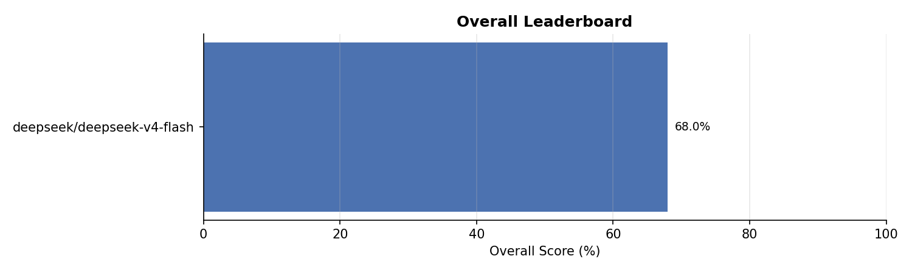
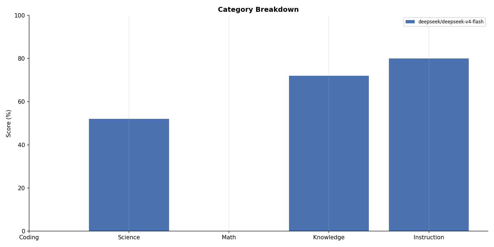
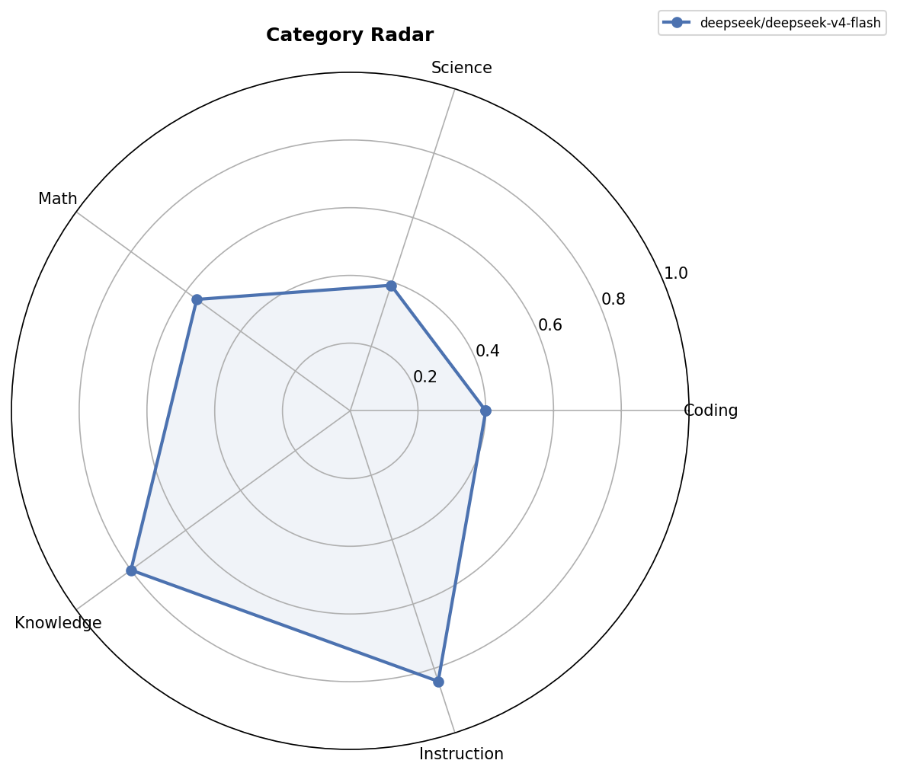
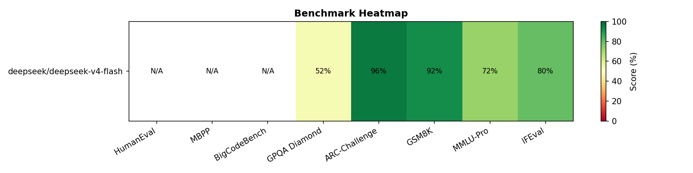
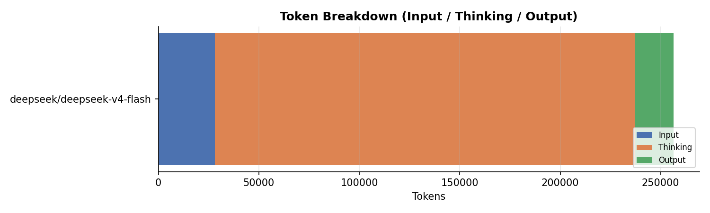
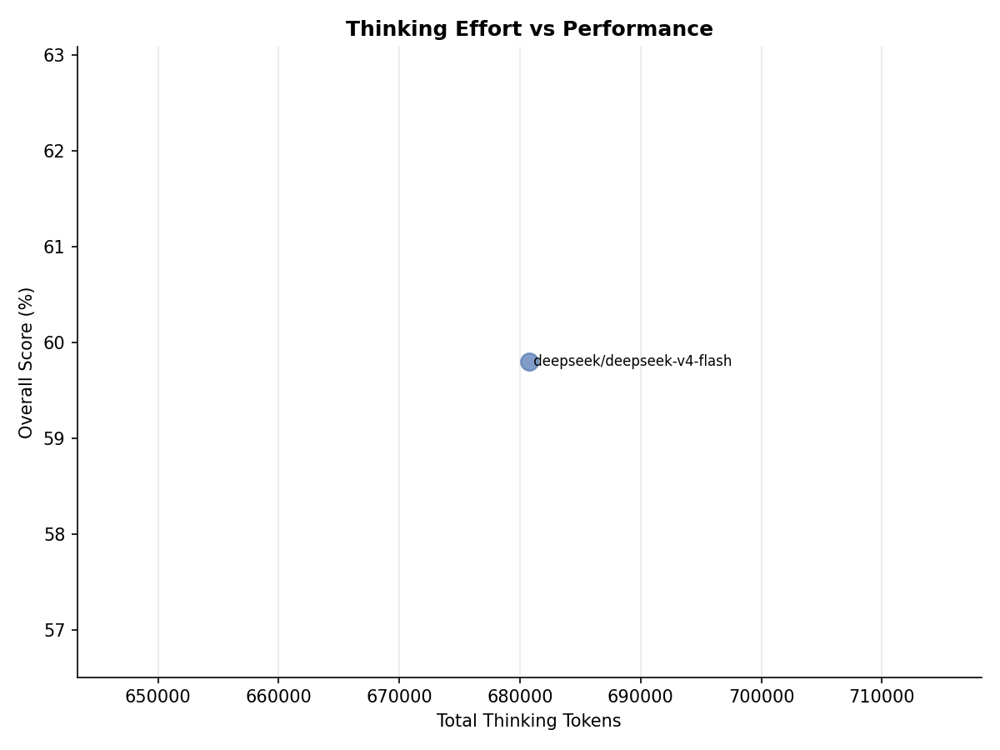
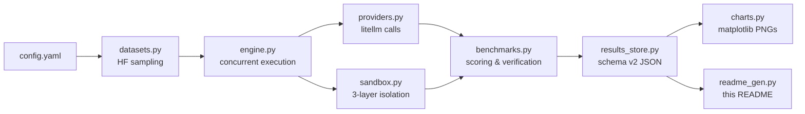

<div align="center">

# 🏆 Lite Benchmarks

### Personal LLM Leaderboard & Benchmark Studio

[](https://github.com/TruftedBug89/lite-benchmarks/actions)
[](https://lite-benchmarks.netlify.app/)
[](https://opensource.org/licenses/MIT)
[](https://www.python.org)


*Small, repeatable samples of established benchmarks with **100% programmatic scoring**. No LLM-as-judge. Deterministic sampling. Sandboxed code execution.*

</div>

> [!NOTE]
> **Project Status:** 🟢 **Working / Functional**  
> *This status must not be changed by AI unless explicitly instructed by the repository owner.*


## 🌐 Live Leaderboard

**[lite-benchmarks.netlify.app](https://lite-benchmarks.netlify.app/)** — interactive leaderboard, charts, and per-benchmark breakdowns, auto-rebuilt from this repo on every push.

## ✨ Why Lite Benchmarks?

<table>
<tr>
<td width="50%">

🎯 **Programmatic Scoring**

Every answer is verified by code — regex extraction, unit test execution, exact match. Zero LLM-as-judge bias.

</td>
<td width="50%">

🔒 **3-Layer Sandboxed Execution**

AST scan → hardened subprocess → Windows Job Object. Model code runs isolated with no API keys, no network, no escape.

</td>
</tr>
<tr>
<td width="50%">

🌐 **Web Dashboard**

Select models, pick benchmarks, run, and generate reports — all from a local browser UI. No CLI wrangling.

</td>
<td width="50%">

🎲 **Deterministic Sampling**

Fixed seed (42) random sampling means the exact same questions every run. Reproducible by design.

</td>
</tr>
<tr>
<td width="50%">

📊 **Statistical Rigor**

Wilson score confidence intervals on every benchmark score. Know exactly how much noise is in the numbers.

</td>
<td width="50%">

💰 **Cost & Token Tracking**

Per-model token breakdown (input/output/thinking), throughput (TPS), latency, and estimated API cost.

</td>
</tr>
</table>

## ⚡ Quick Start

```bash
pip install -e .[dev]    # install dependencies
py web_app.py            # launch dashboard → http://127.0.0.1:8000
```

Then select models, pick benchmarks, hit **Run Benchmarks**, and **Generate Reports**.

## 📑 Table of Contents

- [Live Leaderboard](#-live-leaderboard)
- [Benchmarks](#-benchmarks)
- [Leaderboard](#-leaderboard)
- [Charts](#-charts)
- [Token Usage & Performance](#-token-usage--performance)
- [Architecture](#-architecture)
- [Methodology](#-methodology)
- [How to Run](#-how-to-run)
- [Adding Models](#-adding-models)
- [Project Structure](#-project-structure)

## 📝 Benchmarks

12 established benchmarks, ~50 questions each, grouped into 5 categories:

| Benchmark | Category | Full Dataset | Sampled | Verification | Source |
|-----------|----------|:-----------:|:-------:|-------------|--------|
| **BigCodeBench-Hard** | Coding | 148 | 50 | Python unittest execution (explicit opt-in required) | `bigcode/bigcodebench-hard (v0.1.4)` |
| **HumanEval+** | Coding | 164 | 50 | Python test execution (explicit opt-in required) | `evalplus/humanevalplus` |
| **MBPP+** | Coding | 378 | 50 | Python test execution (explicit opt-in required) | `evalplus/mbppplus` |
| **GPQA Diamond** | Science | 198 | 50 | Multiple choice (4 options) | `nichenshun/gpqa_diamond (community mirror of Idavidrein/gpqa)` |
| **SciBench** | Science | 692 | 50 | Numerical / Formula exact match | `xw27/scibench` |
| **AIME 2024/2025** | Math | 90 | 50 | Integer exact match (000-999) | `AI-MO/aimo-validation-aime` |
| **MATH-500** | Math | 500 | 50 | Exact match / \boxed{} extraction | `HuggingFaceH4/MATH-500` |
| **MMLU-Pro** | Knowledge | 12,032 | 50 | Multiple choice (10 options) | `TIGER-Lab/MMLU-Pro` |
| **IFEval** | Instruction | 541 | 50 | 25 programmatic verifiers (strict) | `google/IFEval` |
| **SciCode** | Coding | 65 | 50 | Python code execution & unit test assertions | `SciCode1/SciCode` |
| **SuperGPQA** | Knowledge | 26,529 (7,050 hard) | 50 | Multiple choice (up to 10 options) | `m-a-p/SuperGPQA` |
| **Tau-Bench (Retail)** | Instruction | 82 | 50 | Agentic tool-call function & argument matching | `amityco/tau-bench-retail-train-next-action` |

## 🏅 Leaderboard

| Rank | Model | Overall | 💻 Coding | 🔬 Science | 📐 Math | 📚 Knowledge | 📋 Instruction |
|:----:|-------|:-------:|:-------:|:-------:|:-------:|:-------:|:-------:|
| 🥇 | **Deepseek v4 Pro Max** 🧠 | **50.1%** | 31.5% | 53.0% | 60.0% | 59.0% | 47.0% |
| 🥈 | **Deepseek v4 Flash Max** 🧠 | **47.8%** | 30.0% | 52.0% | 55.0% | 53.0% | 49.0% |
| 🥉 | **Deepseek v4 Flash** 🧠 | **46.1%** | 28.5% | 46.0% | 55.0% | 55.0% | 46.0% |
| 4 | **Gemma 4 31B** 🧠 | **20.7%** | 0.0% | 42.0% | 20.0% | N/A | N/A |
| 5 | **Gemma 4 26B a4b** 🧠 | N/A | N/A | N/A | N/A | N/A | N/A |

*🧠 indicates reasoning models that utilize thinking tokens or have explicit thinking effort configured.*

### Per-Benchmark Scores

| Model | BigCodeBench-Hard | HumanEval+ | MBPP+ | GPQA Diamond | SciBench | AIME 2024/2025 | MATH-500 | MMLU-Pro | IFEval | SciCode | SuperGPQA | Tau-Bench (Retail) |
|-------|:-------:|:-------:|:-------:|:-------:|:-------:|:-------:|:-------:|:-------:|:-------:|:-------:|:-------:|:-------:|
| Deepseek v4 Pro Max | 22% (11.0/50) ±11.2pp | 98% (49.0/50) ±5.1pp | 6% (3.0/50) ±7.1pp | 60% (30.0/50) ±13.1pp | 46% (23.0/50) ±13.3pp | 36% (18.0/50) ±12.9pp | 84% (42.0/50) ±10.1pp | 78% (39.0/50) ±11.2pp | 84% (42.0/50) ±10.1pp | 0% (0.0/50) ±3.6pp | 40% (20.0/50) ±13.1pp | 10% (5.0/50) ±8.5pp |
| Deepseek v4 Flash Max | 22% (11.0/50) ±11.2pp | 88% (44.0/50) ±9.1pp | 10% (5.0/50) ±8.5pp | 56% (28.0/50) ±13.3pp | 48% (24.0/50) ±13.3pp | 28% (14.0/50) ±12.1pp | 82% (41.0/50) ±10.5pp | 78% (39.0/50) ±11.2pp | 86% (43.0/50) ±9.6pp | 0% (0.0/50) ±3.6pp | 28% (14.0/50) ±12.1pp | 12% (6.0/50) ±9.1pp |
| Deepseek v4 Flash | 16% (8.0/50) ±10.1pp | 88% (44.0/50) ±9.1pp | 10% (5.0/50) ±8.5pp | 52% (26.0/50) ±13.3pp | 40% (20.0/50) ±13.1pp | 26% (13.0/50) ±11.8pp | 84% (42.0/50) ±10.1pp | 78% (39.0/50) ±11.2pp | 84% (42.0/50) ±10.1pp | 0% (0.0/50) ±3.6pp | 32% (16.0/50) ±12.5pp | 8% (4.0/50) ±7.8pp |
| Gemma 4 31B | 0% (0.0/47) ±3.8pp | N/A | N/A | 62% (29.0/47) ±13.4pp | 22% (10.0/45) ±11.9pp | 20% (1.0/5) ±29.4pp | N/A | N/A | N/A | N/A | N/A | N/A |
| Gemma 4 26B a4b | N/A | N/A | N/A | N/A | N/A | N/A | N/A | N/A | N/A | N/A | N/A | N/A |

*±pp indicates 95% Wilson score confidence interval half-width.*

## 📊 Charts

### Overall Scores

*Horizontal bar chart ranked by overall score (average of all category scores).*



### Category Breakdown

*Grouped bar chart comparing each model across the 5 categories.*



### Category Radar

*Spider chart showing each model's profile across categories. Larger area = stronger overall.*



### Benchmark Heatmap

*Per-benchmark scores for every model. Green = high, red = low.*



### Token Breakdown

*Stacked bar chart of input, thinking, and output tokens per model.*



### Thinking Effort vs Performance

*Scatter plot showing if models that use more thinking tokens achieve higher overall scores.*



## 🪙 Token Usage & Performance

| Model | Input | Output | Thinking | Total | Out % | Think % | Avg TPS | Avg Time | Est. Cost |
|-------|------:|-------:|---------:|------:|------:|--------:|--------:|---------:|----------:|
| Deepseek v4 Pro Max | 273,638 | 85,211 | 970,381 | 1,329,230 | 6% | 73% | 49.9 | 38.3s | $1.0374 |
| Deepseek v4 Flash Max | 273,638 | 71,636 | 1,012,225 | 1,357,499 | 5% | 75% | 93.0 | 21.1s | $0.3410 |
| Deepseek v4 Flash | 273,638 | 79,896 | 995,022 | 1,348,556 | 6% | 74% | 92.9 | 21.1s | $0.3344 |
| Gemma 4 31B | 30,457 | 25,685 | 0 | 511,427 | 5% | — | 7.4 | 98.9s | — |
| Gemma 4 26B a4b | 0 | 0 | 0 | 0 | — | — | — | — | — |

*TPS = output tokens/second (cloud APIs only, skipped for local models). Est. Cost calculated via LiteLLM cost tables.*

## 🏗️ Architecture



## 🔬 Methodology

<details>
<summary><strong>📐 Sampling & Statistical Significance</strong></summary>

- **~50 questions** are sampled from each benchmark's full dataset
- Sampling uses a **fixed seed (42)** via random sampling so exact questions are stable across runs
- Samples of n=50 have 95% confidence intervals of roughly ±7–14pp; treat small ranking gaps as noise
- **Scoring v2 Notice**: Sampling and scoring strictness updated in v0.2.0; results are not directly comparable with pre-v0.2.0 runs

</details>

<details>
<summary><strong>✅ Scoring & Verification</strong></summary>

- **All scoring is programmatic** — no LLM-as-judge is used anywhere
- Code benchmarks require explicit opt-in (``allow_unsafe_code_execution``) and run in a layered sandbox: an AST scan of generated code rejects destructive / escape constructs, the child runs with a scrubbed environment (no API keys, temp working dir, no OS/network/process access), and on Windows it is additionally confined by a Job Object that blocks grandchild processes and UI access. The opt-in gate is enforced at the sandbox layer, so it fails closed even for direct callers.
- Multiple-choice benchmarks extract the answer letter and compare to ground truth
- Math benchmarks extract boxed/numerical answers and evaluate via normalized string or numerical comparison
- IFEval uses its 25 strict programmatic verifiers (word count, format, keywords, etc.)
- Tau-Bench verifies tool function name AND argument dictionary match

</details>

<details>
<summary><strong>📊 Category & Overall Scores</strong></summary>

- **Category score** = average of its benchmark scores
  - 💻 **Coding** = avg(BigCodeBench-Hard, HumanEval+, MBPP+, SciCode)
  - 🔬 **Science** = avg(GPQA Diamond, SciBench)
  - 📐 **Math** = avg(AIME 2024/2025, MATH-500)
  - 📚 **Knowledge** = avg(MMLU-Pro, SuperGPQA)
  - 📋 **Instruction** = avg(IFEval, Tau-Bench (Retail))
- **Overall score** = average of completed category scores (equal weight per category)
- Provider failures are excluded and recorded separately; scorer exceptions score 0.0 without retrying provider

</details>

<details>
<summary><strong>⚙️ Inference Settings</strong></summary>

- `temperature`: 0.0
- `max_tokens`: 4096
- `timeout`: 300s per request
- `retries`: transient errors retry with exponential backoff until a good response arrives (no cap); permanent errors (context length, content filter) are never retried

</details>

## 🚀 How to Run

### Prerequisites

```bash
pip install -e .[dev]
```

### API Keys

Set environment variables for the providers you want to test.
[litellm](https://docs.litellm.ai/docs/providers) picks them up automatically.

| Provider | Environment Variable | Get a key |
|----------|---------------------|-----------|
| DeepSeek | `DEEPSEEK_API_KEY` | [platform.deepseek.com](https://platform.deepseek.com) |
| Groq | `GROQ_API_KEY` | [console.groq.com](https://console.groq.com) |
| Google Gemini | `GEMINI_API_KEY` | [aistudio.google.com](https://aistudio.google.com) |
| LM Studio (local) | *(none needed)* | [lmstudio.ai](https://lmstudio.ai) |
| HuggingFace | `HF_TOKEN` | [huggingface.co/settings/tokens](https://huggingface.co/settings/tokens) |

### Running Benchmarks via Web Dashboard

```bash
# Launch the local web dashboard (serves on http://127.0.0.1:8000)
py web_app.py

# Launch without automatically opening browser
py web_app.py --no-browser
```

1. Open the dashboard in your browser.
2. Select models, benchmarks, and settings.
3. Click **Run Benchmarks**.
4. Click **Generate Reports** to update `README.md` and `charts/`.

## ➕ Adding Models

Edit `config.yaml` or add models directly in the Web UI:

```yaml
models:
  - id: anthropic/claude-sonnet-4-20250514
    name: Claude Sonnet 4
    max_tokens: 16384
  - id: openai/gpt-4o
    name: GPT-4o
  - id: lm_studio/qwen2.5-coder-7b-instruct
    name: Qwen 2.5 Coder 7B (local)
```

## 📁 Project Structure

```
├── config.yaml              # Models, benchmarks, categories, settings
├── web_app.py               # Web dashboard server
├── windows_sandbox.py       # Windows Job-object/restricted-token sandbox
├── README.md                # ← this file (auto-generated)
├── web/                     # Web dashboard frontend (HTML/CSS/JS)
├── lite_bench/
│   ├── engine.py            # Unified execution engine & thread concurrency
│   ├── results_store.py     # Results persistence, schema v2, atomic writes
│   ├── metadata.py          # Benchmark display metadata & category mapping
│   ├── config.py            # Config loading & validation
│   ├── providers.py         # litellm wrapper & telemetry
│   ├── datasets.py          # Deterministic HuggingFace sampling
│   ├── benchmarks.py        # Benchmark implementations & verifiers
│   ├── ifeval_verifiers.py  # 25 strict IFEval verifiers
│   ├── sandbox.py           # Code-exec sandbox (AST scan + subprocess + Win job)
│   ├── charts.py            # matplotlib chart generation
│   └── readme_gen.py        # README generator
├── results/                 # JSON results per run
│   └── latest.json          # Leaderboard results (schema v2)
└── charts/                  # Generated PNG charts
```

---

<div align="center">

*Auto-generated by [lite-benchmarks](.) on 2026-07-28 21:24 UTC · Licensed under [MIT](LICENSE) · Built with [litellm](https://github.com/BerriAI/litellm) + [HuggingFace Datasets](https://github.com/huggingface/datasets)*

**⭐ Star this repo if you find it useful!**

</div>
